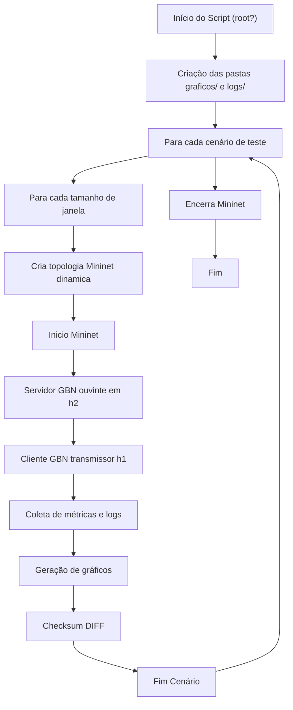

# Relatório


---

## Teste Automatizado

O arquivo `teste_gbn.sh` realiza testes automatizados para avaliar o desempenho do protocolo Go-Back-N (GBN) em uma topologia de rede simulada com Mininet. Utiliza-se diferentes cenários de velocidade, atraso, perda e tamanho da janela. O resultado inclui logs e gráficos de desempenho para comparação e análise.

---

## Requisitos

- **Permissões:** O script exige execução como root (`sudo`).
- **Dependências:**  
    - Mininet  
    - xterm  
    - Python 3  
    - matplotlib  
    - argparse
    - bc, awk
---

## Estrutura

| Artefato         | Função                                                              |
|--------------------------|---------------------------------------------------------------------|
| `graficos/`              | Armazena todos os gráficos gerados em PNG.                          |
| `logs/`                  | Guarda os logs brutos de métricas em TXT.                           |
| `topo_stopandwait.py`    | Topologia mininet gerado dinamicamente baseado no cenário e suas variáveis        |
| `input_02.txt`           | Arquivo de entrada para transmissão (métricas).      |
| `cliente_gbn.py`         | Transmissão de dados.                      |
| `servidor_gbn.py`        | Rececpção dos dados.                         |
| `servidor_log.txt`       | Log da execução do servidor.                             |
| `cliente_log.txt`        | Log da execução do cliente.                              |
| `diff_result.txt`        | Verificar de integridade e confiabilidade na transmissão.       |

---


## Configurações

### Parâmetros

- **janelas:** Tamanhos de janela de envio (4, 8, 16)
- **testes:** Conjunto de cenários variando largura de banda (velocidade), atraso (ms) e perda (%)


### Métricas

| Métrica           | Como é obtida                                                                         |
|-------------------|---------------------------------------------------------------------------------------|
| Transmissao_(s)   | Tempo de transmissão entre início e fim do envio                                      |
| Arquivo_(bits)    | Tamanho do arquivo transmitido em bits * (1 + LOSS)                                                |
| LOSS_(%)          | Extraído do log do cliente pela linha "PERCENTAGE_LOST_PACKETS" utilizando GREP + AWK                      |
| Eficiencia        | Calculada como: (tamanho_ajustado) / (tempo * capacidade_teórica)                     |

## Funções Auxiliares

### Criação da Topologia

A função `init_topology` gera dinamicamente o arquivo Python (`topo_stopandwait.py`) com a topologia desejada para cada teste, configurando largura de banda, atraso e perda.

```sh
function init_topology {
    local vel=$1
    local atraso=$2
    local perda=$3
}
```

---

### Geração de Gráficos

A função `plot` utiliza Python/Matplotlib para gerar gráficos PNG automaticamente para cada métrica e cenário.

```sh
function plot {
    local caso=$1
    local metrica=$2
}
```

---
## Fluxo



---


## Artefatos

Ao término de cada execução, para cada cenário e janela, o script gera:

- **Logs**: Arquivos TXT em `logs/CASO/METRICA.txt`
- **Gráficos**: Salvos em `graficos/CASO/METRICA.png`  


