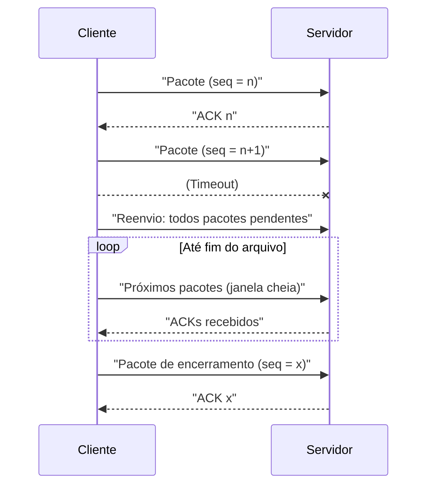
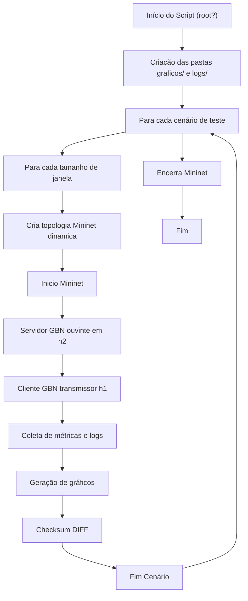

# Relatório

## Cliente GBN (`cliente_gbn.py`)

### Diagrama



---

### Execução

```sh
python cliente_gbn.py -w 8 -f input_02.txt
```

- `-w` ou `--window`: define o tamanho da janela (4, 8, 16).
- `-f` ou `--file`: Path para o arquivo de entrada.


### Configurações

| Parâmetro           | Valor padrão        | Descrição                                   |
|---------------------|--------------------|---------------------------------------------|
| `N`                 | 16                 | Tamanho da janela deslizante                |
| `TIMEOUT`           | 2 segundos         | Tempo máximo de ACK                  |
| `BLOCK_SIZE`        | 512 bytes          | Tamanho do payload) de cada pacote   |
| `SERVER_IP`         | '10.0.0.2'         | Endereço IP do servidor                     |
| `PORT`              | 5000               | Porta UDP do servidor                       |
| `INPUT_FILE_PATH`   | 'input_02.txt'     | Path do arquivo de entrada               |

### Métricas

Como saída, nos logs, encontra-se os valores de:

- Número de pacotes esperados (`EXPECTED_PACKETS`)
- Número de pacotes efetivamente enviados (`SENT_PACKETS`)
- Percentual de perda de pacotes, levando em consideração o número de pacotes que sofreram retransmissões através da soma com número esperado de pacotes. (`PERCENTAGE_LOST_PACKETS`)

```python
print('PERCENTAGE_LOST_PACKETS {:.2f}'.format(
    ((count_sent_packets - count_expected_packets) / count_expected_packets) * 100
))
```
---

### Controle de Fluxo

- Pacotes pendentes a partir do menor `seq` não confirmado são reenviados em caso de timeout.
- Lista (`sliding_window`) de tuplas `(seq, packet)` mantendo controle sobre os pacotes pedentes.
- Mantendo os pacotes com tamanho de 1 byte, torna-se necessário o módulo 256, para evitar overflow de capacidade de dados inteiros.

#### Gerenciamento da Janela

```python
    ack, _ = sock.recvfrom(1)
    ack_num = int.from_bytes(ack, 'big')
    print('ACK {} recebido'.format(ack_num))

    if ack_num >= current_seq:
        sliding_window = [
            (seq, p) for seq, p in sliding_window if seq > ack_num
        ]
        current_seq = (ack_num + 1) % 256
```

#### Tratando Timeout
```python
    except socket.timeout:
        print('Timeout, reenviando a partir de seq={}'.format(current_seq))
        for seq, packet_data in sliding_window:
            sock.sendto(packet_data, (SERVER_IP, PORT))
            count_sent_packets += 1
            print('Reenviado quadro com seq={}'.format(seq))
```

---


---

## Teste Automatizado

O arquivo `teste_gbn.sh` realiza testes automatizados para avaliar o desempenho do protocolo Go-Back-N (GBN) em uma topologia de rede simulada com Mininet. Utiliza-se diferentes cenários de velocidade, atraso, perda e tamanho da janela. O resultado inclui logs e gráficos de desempenho para comparação e análise.

### Diagrama



---
---

### Requisitos

- **Permissões:** O script exige execução como root (`sudo`).
- **Dependências:**  
    - Mininet  
    - xterm  
    - Python 3  
    - matplotlib  
    - argparse
    - bc, awk
---

### Estrutura

| Artefato         | Função                                                              |
|--------------------------|---------------------------------------------------------------------|
| `graficos/`              | Armazena todos os gráficos gerados em PNG.                          |
| `logs/`                  | Guarda os logs de métricas em TXT.                           |
| `topo_stopandwait.py`    | Topologia mininet gerado dinamicamente baseado no cenário e suas variáveis        |
| `input_02.txt`           | Arquivo de entrada para transmissão (métricas).      |
| `cliente_gbn.py`         | Transmissão de dados.                      |
| `servidor_gbn.py`        | Rececpção dos dados.                         |
| `servidor_log.txt`       | Log da execução do servidor.                             |
| `cliente_log.txt`        | Log da execução do cliente.                              |
| `diff_result.txt`        | Verificar de integridade e confiabilidade na transmissão.       |

---


### Configurações

#### Parâmetros

- **janelas:** Tamanhos de janela de envio (4, 8, 16)
- **testes:** Conjunto de cenários variando largura de banda (velocidade), atraso (ms) e perda (%)


#### Métricas

| Métrica           | Como é obtida                                                                         |
|-------------------|---------------------------------------------------------------------------------------|
| Transmissao_(s)   | Tempo de transmissão entre início e fim do envio                                      |
| Arquivo_(bits)    | Tamanho do arquivo transmitido em bits * (1 + LOSS)                                                |
| LOSS_(%)          | Extraído do log do cliente pela linha "PERCENTAGE_LOST_PACKETS" utilizando GREP + AWK                      |
| Eficiencia        | Calculada como: (tamanho_ajustado) / (tempo * capacidade_teórica)                     |

### Funções Auxiliares

#### Criação da Topologia

A função `init_topology` gera dinamicamente o arquivo Python (`topo_stopandwait.py`) com a topologia desejada para cada teste, configurando largura de banda, atraso e perda.

```sh
function init_topology {
    local vel=$1
    local atraso=$2
    local perda=$3
}
```

---

#### Geração de Gráficos

A função `plot` utiliza Python/Matplotlib para gerar gráficos PNG automaticamente para cada métrica e cenário.

```sh
function plot {
    local caso=$1
    local metrica=$2
}
```

---

### Artefatos

Ao término de cada execução, para cada cenário e janela, o script gera:

- **Logs**: Arquivos TXT em `logs/CASO/METRICA.txt`
- **Gráficos**: Salvos em `graficos/CASO/METRICA.png`  


